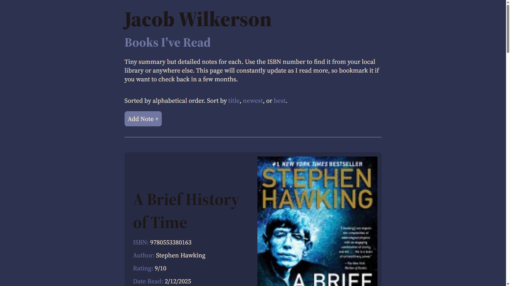
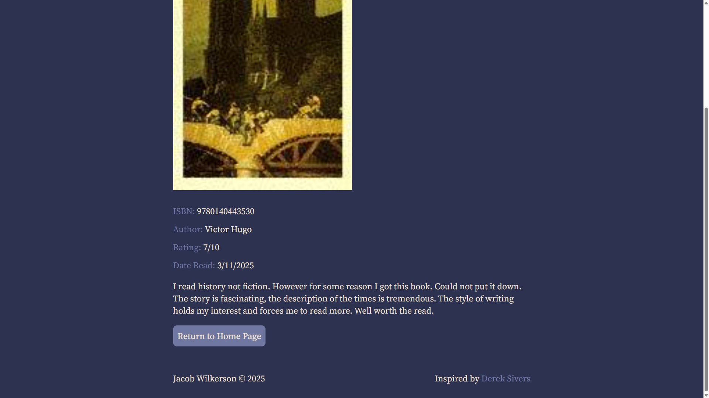
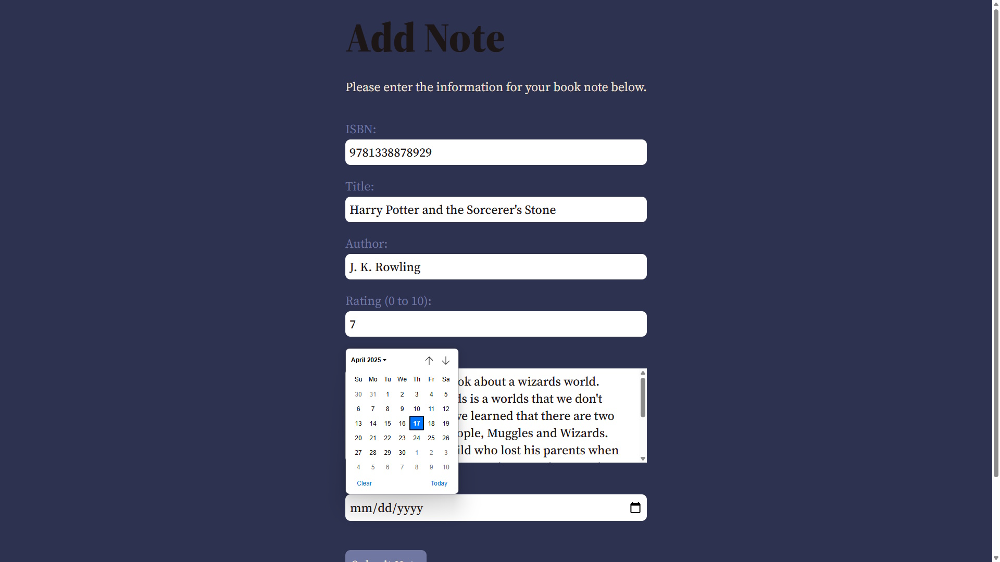

# Book Notes
## Description
A web application that allows me to keep track of all the non-fiction books I have read, my notes about them, my ratings, and the dates in which I read them. This project utilizes the [Open Library Covers API](https://openlibrary.org/dev/docs/api/covers) for book covers.

## Technologies
- JavaScript
- Node.js
- Express
- EJS
- Axios
- RESTful APIs
- SQL
- PostgreSQL

## Showcase
The Home Page

View the Book Notes

Add a New Entry

